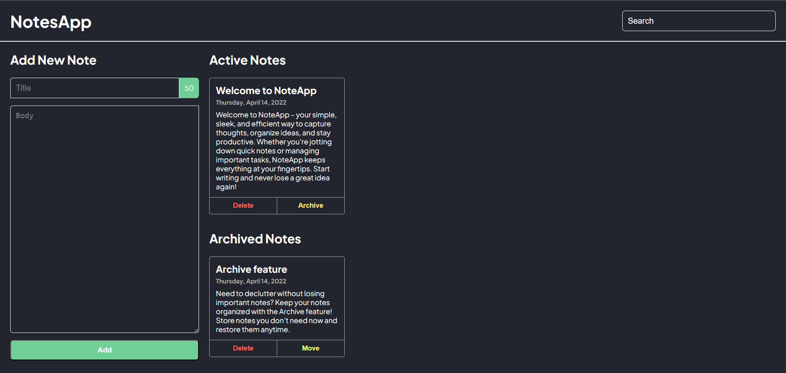

# 📝 NoteApp

🚀 A sleek and efficient notes-taking web app built with **ReactJS** and powered by a **NodeJS** server. Stay organized, jot down ideas, and archive important notes effortlessly!

## 🌟 Features

✅ **Create & Manage Notes** – Write down your thoughts with ease  
✅ **Archive Notes** – Declutter without deleting, restore anytime  
✅ **Modern UI** – Simple, clean, and intuitive design  
✅ **Fast & Lightweight** – Powered by ReactJS for smooth performance

## 🎥 Preview

  

## 🛠️ Tech Stack
 


## 🚀 Installation & Setup

1. **Clone the repository**
   ```sh
   git clone https://github.com/yourusername/noteapp.git
   cd noteapp
   ```
2. **Install dependencies**
   ```sh
   npm install
   ```
3. **Run the development server**
   ```sh
   npm run dev
   ```

## 🤝 Contributing

We welcome contributions! Feel free to fork, submit issues, and make pull requests.

## 🐝 License

This project is open-source under the **MIT License**.

---

💡 _Happy coding! If you like this project, don't forget to ⭐ the repo!_
